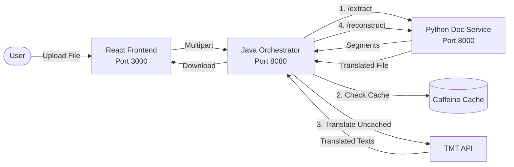

# Google TMT Hackathon 2026 — File Translation Tool


A production-ready microservice architecture for translating documents between English, Nepali, and Tamang while preserving exact formatting and layout.

Track B2 Submission for the Google TMT Hackathon 2026.

## 🌟 Key Features

- **Exact Layout Preservation**: Uses PyMuPDF and python-docx to map precise formatting.
- **Microservice Architecture**: Python (fast parsing) + Java (robust orchestration) + React (premium UI).
- **Extreme Performance**:
  - **Virtual Threads (Java 21)** for massive concurrent API calls.
  - **Smart Caching (Caffeine)** for instantaneous re-translations.
  - **Adaptive Batching** by segment count and character limits.
- **Resilience**: Exponential backoff and retry mechanisms for the TMT API.

## 🏗️ Architecture



## 🚀 Quick Start (Docker)

Ensure Docker and Docker Compose are installed.

```bash
cd tmt-file-translator
docker-compose up --build
```

Access the UI at: **http://localhost:3000**

## 🔧 Supported Formats

- **.pdf**: Exact coordinate mapping, dynamic Devanagari font scaling.
- **.docx**: Preserves paragraphs, tables, runs, bold/italic styles.
- **.csv / .tsv**: Maintains grid structure and delimiters.

## 🌐 API Endpoints

### Orchestrator (Port 8080)
- `POST /api/v1/translate` (form-data: `file`, `sourceLang`, `targetLang`)
- `GET /api/v1/translate/languages`

### Doc Service (Port 8000)
- `POST /extract` (form-data: `file`)
- `POST /reconstruct` (form-data: `file`, `segments`)

## 👨‍💻 Tech Stack

- **Frontend**: React, Vite, TypeScript, Tailwind CSS v4, Lucide Icons
- **Orchestrator**: Java 21, Spring Boot 3, Caffeine Cache, WebFlux
- **Doc Service**: Python 3.12, FastAPI, PyMuPDF, python-docx
